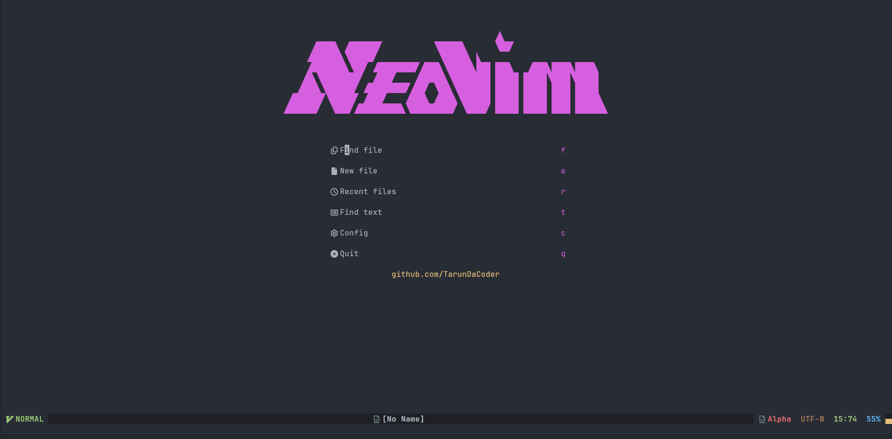
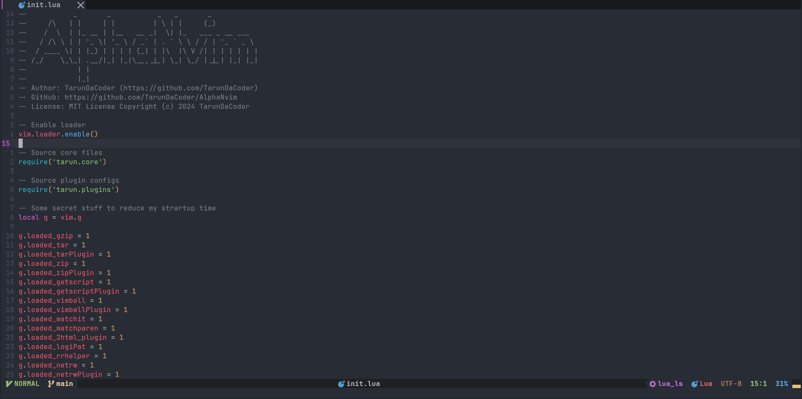

# AlphaNvim
## The α Alpha of all neovim configs
AlphaNvim is my own neovim configuration after [BobVim](https://github.com/TarunDaCoder/BobVim) which isn't really that blazing and isn't really that bloat ¯\\\_(ツ)_/¯

## Screenshots





## Installation
- First run the [rocks.nvim](https://github.com/nvim-neorocks/rocks.nvim) installation script. [rocks.nvim](https://github.com/nvim-neorocks/rocks.nvim) is the package manager I use.
```sh
nvim -u NORC -c "source https://raw.githubusercontent.com/nvim-neorocks/rocks.nvim/master/installer.lua"
```

- Then, run this command -
```sh
mv ~/.config/nvim ~/.config/nvim.bak
mv ~/.local/share/nvim ~/.local/share/nvim.bak

git clone https://github.com/TarunDaCoder/AlphaNvim.git ~/.config/nvim
```
- Then, inside of neovim do `:Rocks sync`
- And, ta-da! You now have `AlphaNvim` installed! 🎉

## Plugins used
- [rocks.nvim](https://github.com/nvim-neorocks/rocks.nvim) is our package manager
- [nvim-cmp](https://github.com/hrsh7th/nvim-cmp) for completions
- [bufferline.nvim](https://github.com/akinsho/bufferline.nvim) is the tabline
- [feline.nvim](https://github.com/freddiehaddad/feline.nvim) is the statusline
    - [this](https://github.com/Hitesh-Aggarwal/feline_theme.nvim) is the feline theme i used
- [telescope.nvim](https://github.com/nvim-telescope/telescope.nvim) is the fuzzy finder
- [conform.nvim](https://github.com/stevearc/conform.nvim) for formatting
- [overseer.nvim](https://github.com/stevearc/overseer.nvim) for code running
- [trouble.nvim](https://github.com/folke/trouble.nvim) better quickfix list and lots more...
- [indent-blankline.nvim](https://github.com/lukas-reineke/indent-blankline.nvim)
- [which-key.nvim](https://github.com/folke/which-key.nvim)
- [alpha-nvim](https://github.com/goolord/alpha-nvim) dashboard
- [nvim-spectre](https://github.com/nvim-pack/nvim-spectre) quick find and replace
- [image.nvim](https://github.com/3rd/image.nvim) for image previewing
- [sus.nvim](https://github.com/TarunDaCoder/sus.nvim) for a little bit of fun
- and many more...
